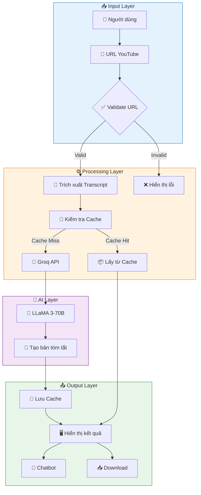
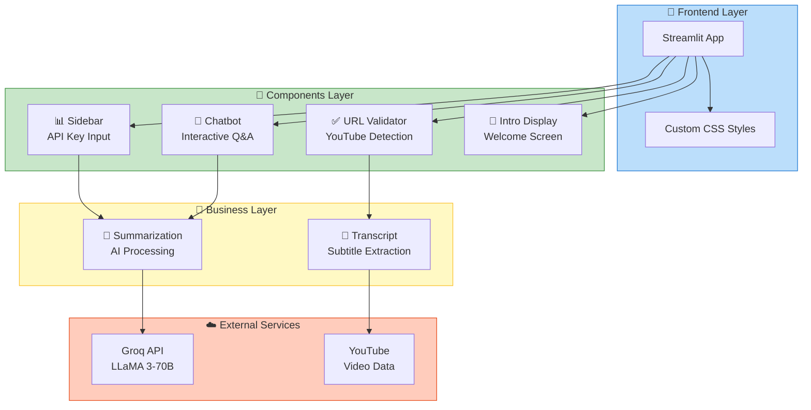
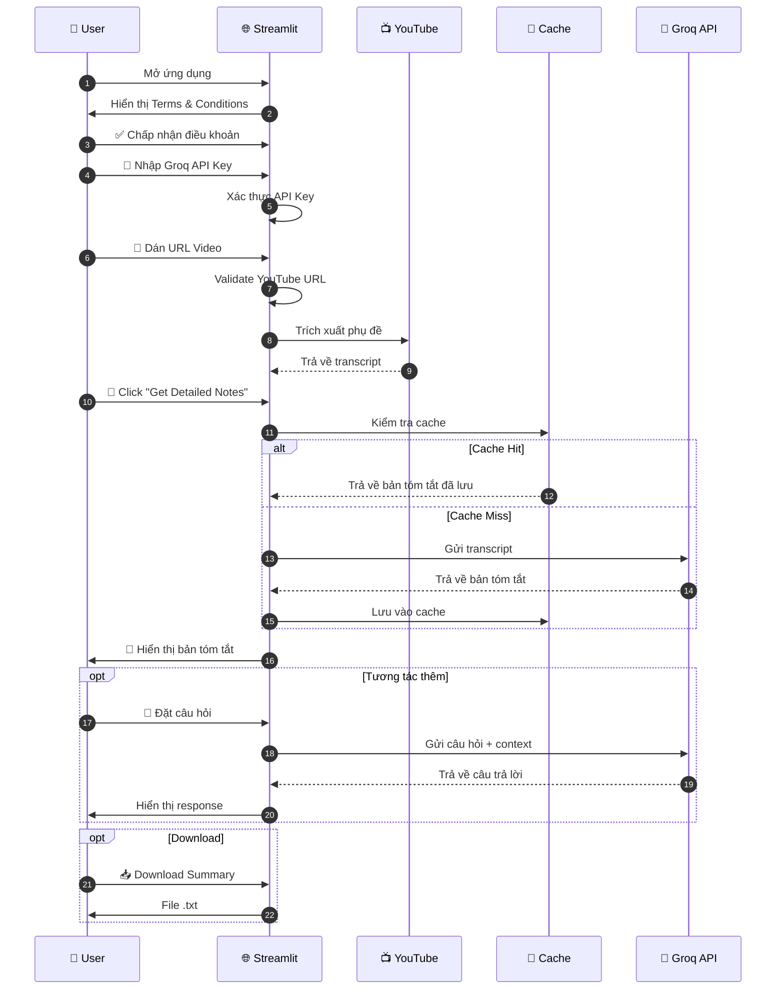
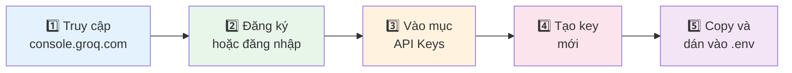
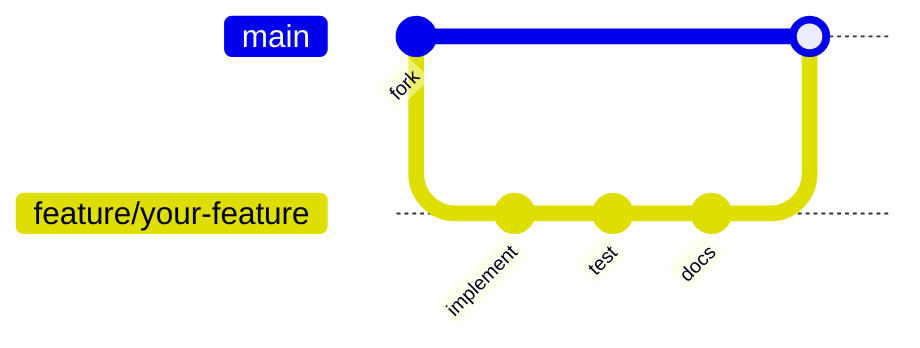

<div align="center">

# 🎬 AI YouTube Summarizer

### Công cụ tóm tắt video YouTube thông minh sử dụng AI

[](https://python.org)
[](https://streamlit.io)
[](https://creativecommons.org/licenses/by-nc-sa/4.0/)
[](https://groq.com)


**Tóm tắt nội dung video YouTube chỉ trong vài giây với sức mạnh của AI LLaMA 3-70B**

[🚀 Bắt đầu ngay](#-cài-đặt) • [✨ Tính năng](#-tính-năng-chính) • [📖 Hướng dẫn](#-hướng-dẫn-sử-dụng) • [🤝 Đóng góp](#-hướng-dẫn-đóng-góp)

---

</div>

## 📖 Giới thiệu

**AI YouTube Summarizer** là ứng dụng web hiện đại được xây dựng trên nền tảng **Streamlit**, giúp người dùng tóm tắt nội dung video YouTube hoặc podcast một cách nhanh chóng và hiệu quả. 

Sử dụng mô hình AI tiên tiến **LLaMA 3-70B** thông qua **Groq API** - nền tảng inference AI nhanh nhất thế giới, ứng dụng mang đến trải nghiệm tóm tắt video trong **tích tắc**.

### 🎯 Vấn đề được giải quyết

> 💡 *"Bạn không có thời gian xem video 2 tiếng đồng hồ? Hãy để AI tóm tắt trong 30 giây!"*

- ⏰ **Tiết kiệm thời gian** - Không cần xem toàn bộ video dài
- 📝 **Nắm bắt ý chính** - Bản tóm tắt súc tích, đầy đủ thông tin
- 🌍 **Đa ngôn ngữ** - Hỗ trợ 10+ ngôn ngữ phổ biến
- 💬 **Tương tác thông minh** - Chatbot AI để hỏi đáp chi tiết

---

## ✨ Tính năng chính

<table>
<tr>
<td width="50%">

### 🤖 Tóm tắt AI thông minh
Sử dụng **LLaMA 3-70B** để tạo bản tóm tắt chất lượng cao, ngắn gọn và đầy đủ ý chính từ bất kỳ video YouTube nào.

### 🌍 Hỗ trợ đa ngôn ngữ
Hỗ trợ **10+ ngôn ngữ** bao gồm:
- 🇬🇧 English
- 🇪🇸 Español  
- 🇫🇷 Français
- 🇩🇪 Deutsch
- 🇨🇳 中文
- 🇮🇳 हिन्दी
- 🇸🇦 العربية
- 🇷🇺 Русский
- 🇧🇷 Português

</td>
<td width="50%">

### 💬 Chatbot tương tác
Sau khi tạo bản tóm tắt, sử dụng **chatbot AI** để đặt câu hỏi chi tiết về nội dung video.

### ⚡ Hiệu suất cao
- 🔄 **Cache thông minh** - Lưu trữ tạm thời để tái sử dụng
- 🚀 **Groq Inference** - Xử lý siêu nhanh
- 💾 **Không cần database** - Hoạt động độc lập

### 📥 Xuất dữ liệu dễ dàng
- Download bản tóm tắt dưới dạng `.txt`
- Sao chép trực tiếp vào clipboard

</td>
</tr>
</table>

### 🔐 Bảo mật & Quyền riêng tư

| Tính năng | Mô tả |
|-----------|-------|
| 🔒 **Không lưu trữ API Key** | API key chỉ tồn tại trong session |
| 🛡️ **Xử lý real-time** | Không lưu trữ dữ liệu trên server |
| 🔑 **Mã hóa đầu vào** | Input được bảo vệ an toàn |

---

## 🏗️ Kiến trúc tổng thể

### Sơ đồ luồng xử lý chính



### Sơ đồ kiến trúc thành phần



### Sơ đồ tuần tự (Sequence Diagram)



---

## 🚀 Cài đặt

### 📋 Yêu cầu hệ thống

| Yêu cầu | Phiên bản tối thiểu |
|---------|---------------------|
| 🐍 Python | 3.8+ |
| 📦 pip | Phiên bản mới nhất |
| 🌐 Internet | Kết nối ổn định |
| 🔑 Groq API Key | [Đăng ký miễn phí](https://console.groq.com/keys) |

### 📥 Bước 1: Clone repository

```bash
# Clone dự án về máy
git clone https://github.com/<your-username>/ai-youtube-summarizer.git

# Di chuyển vào thư mục dự án
cd ai-youtube-summarizer
```

### 🔧 Bước 2: Tạo môi trường ảo (Khuyến nghị)

<details>
<summary><b>Windows</b></summary>

```bash
# Tạo môi trường ảo
python -m venv venv

# Kích hoạt môi trường ảo
venv\Scripts\activate
```
</details>

<details>
<summary><b>macOS / Linux</b></summary>

```bash
# Tạo môi trường ảo
python3 -m venv venv

# Kích hoạt môi trường ảo
source venv/bin/activate
```
</details>

### 📦 Bước 3: Cài đặt dependencies

```bash
pip install -r requirements.txt
```

#### Danh sách thư viện

| Thư viện | Phiên bản | Mục đích |
|----------|-----------|----------|
| `streamlit` | Latest | 🌐 Framework UI chính |
| `groq` | Latest | 🤖 API client cho Groq AI |
| `yt-dlp` | Latest | 📺 Trích xuất phụ đề YouTube |
| `python-dotenv` | Latest | 🔐 Quản lý biến môi trường |
| `beautifulsoup4` | Latest | 📝 Phân tích HTML |
| `requests` | Latest | 🌍 HTTP requests |
| `pyperclip` | Latest | 📋 Copy vào clipboard |
| `pathlib` | Built-in | 📁 Xử lý đường dẫn |

---

## ▶️ Chạy dự án

### Khởi động ứng dụng

```bash
streamlit run app.py
```

### 🌐 Truy cập ứng dụng

Sau khi chạy, ứng dụng sẽ tự động mở trong trình duyệt:

```
🏠 Local URL:    http://localhost:8501
🌍 Network URL:  http://<your-ip>:8501
```

### ⚙️ Cấu hình Streamlit (Tùy chọn)

Tạo file `.streamlit/config.toml` để tùy chỉnh:

```toml
[server]
port = 8501
headless = true
runOnSave = true

[browser]
gatherUsageStats = false

[theme]
primaryColor = "#FF6B6B"
backgroundColor = "#FFFFFF"
secondaryBackgroundColor = "#F0F2F6"
textColor = "#262730"
font = "sans serif"
```

---

## ⚙️ Cấu hình biến môi trường

### 📄 Tạo file `.env`

Tạo file `.env` trong thư mục gốc của dự án:

```env
# ====================================
# 🔐 GROQ API CONFIGURATION
# ====================================

# API Key từ Groq Console
GROQ_API_KEY=gsk_xxxxxxxxxxxxxxxxxxxxxxxxxxxxxxxx

# ====================================
# 🔧 OPTIONAL SETTINGS
# ====================================

# Chế độ debug (true/false)
DEBUG=false

# Thời gian cache (giây) - mặc định 3600 = 1 giờ
CACHE_EXPIRY=3600
```

### 🔑 Hướng dẫn lấy Groq API Key



1. Truy cập [Groq Console](https://console.groq.com/keys)
2. Đăng ký tài khoản miễn phí hoặc đăng nhập
3. Click **"Create API Key"**
4. Đặt tên cho key và copy
5. Dán vào file `.env`

### ⚠️ Lưu ý bảo mật

> 🔴 **QUAN TRỌNG:**
> - ❌ Không commit file `.env` lên Git
> - ❌ Không chia sẻ API key công khai
> - ✅ Thêm `.env` vào `.gitignore`
> - ✅ Sử dụng password manager để lưu trữ

### 📊 Giới hạn API Groq

| Gói | Requests/phút | Tokens/phút |
|-----|---------------|-------------|
| Free | 30 | 6,000 |
| Paid | Không giới hạn | Theo gói |

📎 Chi tiết: [Groq Rate Limits](https://console.groq.com/docs/rate-limits)

---

## 📁 Cấu trúc thư mục

```
ai-youtube-summarizer/
│
├── 📄 app.py                     # 🚀 Entry point - Ứng dụng chính
├── 📄 requirements.txt           # 📦 Danh sách dependencies
├── 📄 packages.txt               # 📦 System packages (deployment)
├── 📄 License                    # 📜 Giấy phép CC BY-NC-SA 4.0
├── 📄 readme.md                  # 📖 Documentation
├── 📄 FirstRunGuide.txt          # 📋 Hướng dẫn chạy lần đầu
├── 🖼️ AI_YouTube_Summarizer.png  # 🎨 Logo ứng dụng
├── 📄 .gitignore                 # 🚫 Git ignore rules
├── 📄 .gitattributes             # ⚙️ Git attributes
│
├── 📂 components/                # 🧩 UI Components
│   ├── 📄 __init__.py            # Package init
│   ├── 📄 chatbot.py             # 💬 Chatbot AI tương tác
│   ├── 📄 intro.py               # 👋 Màn hình chào mừng
│   ├── 📄 sidebar.py             # 📊 Sidebar cấu hình API
│   └── 📄 url_validation.py      # ✅ Xác thực URL YouTube
│
├── 📂 utils/                     # 🔧 Utility Functions
│   ├── 📄 __init__.py            # Package init
│   ├── 📄 summarization.py       # 🤖 Logic tóm tắt với LLaMA
│   └── 📄 youtube_transcript.py  # 📝 Trích xuất phụ đề
│
├── 📂 config/                    # ⚙️ Configuration
│   ├── 📄 __init__.py            # Package init
│   └── 📄 settings.py            # 🔐 Quản lý API key & settings
│
├── 📂 styles/                    # 🎨 CSS Styles
│   ├── 📄 __init__.py            # Package init
│   └── 📄 styles.py              # 💅 Custom CSS cho UI
│
├── 📂 .streamlit/                # 🌐 Streamlit Configuration
│   └── 📄 config.toml            # ⚙️ Cấu hình Streamlit
│
└── 📂 .devcontainer/             # 🐳 Development Container
    └── ...                       # Docker/VS Code dev setup
```

### 📝 Chi tiết các Module

#### 🎯 `app.py` - Main Application

File chính điều khiển toàn bộ ứng dụng:
- Khởi tạo Streamlit config
- Quản lý session state
- Điều phối các components
- Xử lý Terms & Conditions
- Trích xuất transcript từ YouTube

#### 🧩 `components/` - UI Components

| File | Chức năng | Mô tả |
|------|-----------|-------|
| `chatbot.py` | 💬 Chatbot | Giao diện chat, xử lý Q&A với AI |
| `intro.py` | 👋 Intro | Hiển thị trang giới thiệu |
| `sidebar.py` | 📊 Sidebar | Quản lý API key input |
| `url_validation.py` | ✅ Validator | Kiểm tra URL YouTube hợp lệ |

#### 🔧 `utils/` - Business Logic

| File | Chức năng | Mô tả |
|------|-----------|-------|
| `summarization.py` | 🤖 AI Core | Xử lý tóm tắt với LLaMA 3-70B |
| `youtube_transcript.py` | 📝 Extractor | Trích xuất phụ đề từ YouTube |

#### ⚙️ `config/` - Configuration

| File | Chức năng | Mô tả |
|------|-----------|-------|
| `settings.py` | 🔐 Settings | Load API key từ environment |

---

## 📋 Hướng dẫn sử dụng

### 🎬 Quy trình sử dụng

<table>
<tr>
<td>

**Bước 1️⃣**

Mở ứng dụng và **chấp nhận điều khoản** sử dụng

</td>
<td>

**Bước 2️⃣**

Nhập **Groq API Key** vào sidebar (hoặc cấu hình qua `.env`)

</td>
</tr>
<tr>
<td>

**Bước 3️⃣**

**Dán URL** video YouTube cần tóm tắt

</td>
<td>

**Bước 4️⃣**

Chọn **ngôn ngữ** phụ đề của video

</td>
</tr>
<tr>
<td>

**Bước 5️⃣**

Click **"Get Detailed Notes"** để tạo bản tóm tắt

</td>
<td>

**Bước 6️⃣**

**Tải xuống** hoặc tiếp tục **chat** với AI

</td>
</tr>
</table>

### 💬 Sử dụng Chatbot

Sau khi có bản tóm tắt, bạn có thể:
- Đặt câu hỏi chi tiết về nội dung video
- Yêu cầu giải thích thêm các điểm cụ thể
- Tạo các bản tóm tắt theo phong cách khác

**Ví dụ câu hỏi:**
```
- "Giải thích chi tiết hơn về điểm thứ 3"
- "Tóm tắt lại ngắn hơn trong 3 câu"
- "Liệt kê các số liệu được đề cập"
```

---

## 🤝 Hướng dẫn đóng góp

Chúng tôi hoan nghênh mọi đóng góp từ cộng đồng! 🎉

### 📌 Quy trình đóng góp



### 🔄 Các bước thực hiện

1. **Fork** repository
   ```bash
   # Click nút Fork trên GitHub
   ```

2. **Clone** về máy
   ```bash
   git clone https://github.com/<your-username>/ai-youtube-summarizer.git
   ```

3. **Tạo branch** mới
   ```bash
   git checkout -b feature/amazing-feature
   ```

4. **Code** và test kỹ

5. **Commit** với message rõ ràng
   ```bash
   git commit -m "✨ feat: Add amazing feature"
   ```

6. **Push** lên GitHub
   ```bash
   git push origin feature/amazing-feature
   ```

7. **Mở Pull Request** trên GitHub

### 📝 Quy tắc Commit Message

Sử dụng [Conventional Commits](https://www.conventionalcommits.org/):

| Emoji | Type | Mô tả | Ví dụ |
|-------|------|-------|-------|
| ✨ | `feat` | Tính năng mới | `✨ feat: Add export PDF` |
| 🐛 | `fix` | Sửa lỗi | `🐛 fix: Fix cache issue` |
| 📝 | `docs` | Cập nhật docs | `📝 docs: Update README` |
| 💄 | `style` | UI/CSS | `💄 style: Improve button` |
| ♻️ | `refactor` | Refactor code | `♻️ refactor: Optimize loop` |
| 🧪 | `test` | Thêm tests | `🧪 test: Add unit tests` |
| 🔧 | `chore` | Chores | `🔧 chore: Update deps` |

### 🎨 Code Style Guide

- ✅ Sử dụng **Black** để format code
- ✅ Tuân thủ **PEP 8**
- ✅ Viết **docstrings** cho functions
- ✅ Thêm **type hints**
- ✅ Comment code phức tạp

---

## 📜 Giấy phép

Dự án được phân phối dưới giấy phép **Creative Commons Attribution-NonCommercial-ShareAlike 4.0 International (CC BY-NC-SA 4.0)**.

<table>
<tr>
<td width="50%">

### ✅ Bạn được phép

- 📤 **Chia sẻ** — Sao chép và phân phối
- 🔄 **Chỉnh sửa** — Remix và xây dựng thêm

</td>
<td width="50%">

### ⚠️ Điều kiện

- 📛 **Ghi công** — Credit tác giả gốc
- 🚫 **Phi thương mại** — Không dùng cho mục đích thương mại
- 🔄 **Chia sẻ tương tự** — Dùng cùng giấy phép

</td>
</tr>
</table>

📎 Chi tiết: [https://creativecommons.org/licenses/by-nc-sa/4.0/](https://creativecommons.org/licenses/by-nc-sa/4.0/)

---

## 🗺️ Lộ trình phát triển

### 📍 Phiên bản hiện tại: v1.0.0

- [x] ✅ Tóm tắt video YouTube
- [x] ✅ Hỗ trợ 10+ ngôn ngữ
- [x] ✅ Chatbot AI tương tác
- [x] ✅ Cache management
- [x] ✅ Download bản tóm tắt
- [x] ✅ Terms & Conditions

### 🔜 Phiên bản 1.1.0 (Q2 2026)

- [ ] 📋 Hỗ trợ YouTube Playlist
- [ ] 📄 Export sang PDF/Word
- [ ] 📊 Lịch sử tóm tắt
- [ ] 🎨 Multiple themes
- [ ] 📱 Responsive mobile UI

### 🚀 Phiên bản 2.0.0 (Q3 2026)

- [ ] 👤 User authentication
- [ ] ☁️ Cloud storage
- [ ] 🔌 REST API endpoint
- [ ] 📺 Hỗ trợ Vimeo, Dailymotion
- [ ] ⏱️ Tóm tắt theo timestamp
- [ ] 🧠 Mind map generation

### 🌟 Phiên bản 3.0.0 (Tương lai)

- [ ] 📱 Mobile app (iOS/Android)
- [ ] 🔌 Browser extension
- [ ] 👥 Team collaboration
- [ ] 🔊 AI voice narration
- [ ] 🎥 Video highlights extraction

---

## 🙏 Lời cảm ơn

Cảm ơn các dự án và công nghệ tuyệt vời:

<table>
<tr>
<td align="center">
<a href="https://streamlit.io">
<br/>
<b>Streamlit</b>
</a>
</td>
<td align="center">
<a href="https://groq.com">
<br/>
<b>Groq</b>
</a>
</td>
<td align="center">
<a href="https://ai.meta.com/llama/">
<br/>
<b>LLaMA</b>
</a>
</td>
<td align="center">
<a href="https://github.com/yt-dlp/yt-dlp">
<br/>
<b>yt-dlp</b>
</a>
</td>
</tr>
</table>

---

<div align="center">

### ⭐ Nếu dự án hữu ích, hãy cho chúng tôi một Star!

**Made with ❤️ by the Community**

[](https://github.com/your-username/ai-youtube-summarizer)
[](https://github.com/your-username/ai-youtube-summarizer)

[🐛 Báo lỗi](https://github.com/your-username/ai-youtube-summarizer/issues) • 
[💡 Đề xuất tính năng](https://github.com/your-username/ai-youtube-summarizer/issues) • 
[📧 Feedback](https://forms.gle/EphDUS8x6Z1QdLLj9)

---

**© 2026 AI YouTube Summarizer. All rights reserved.**

</div>
