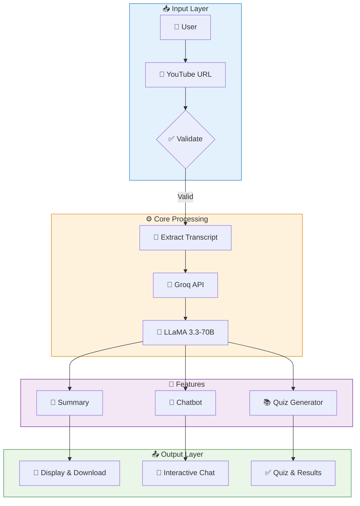
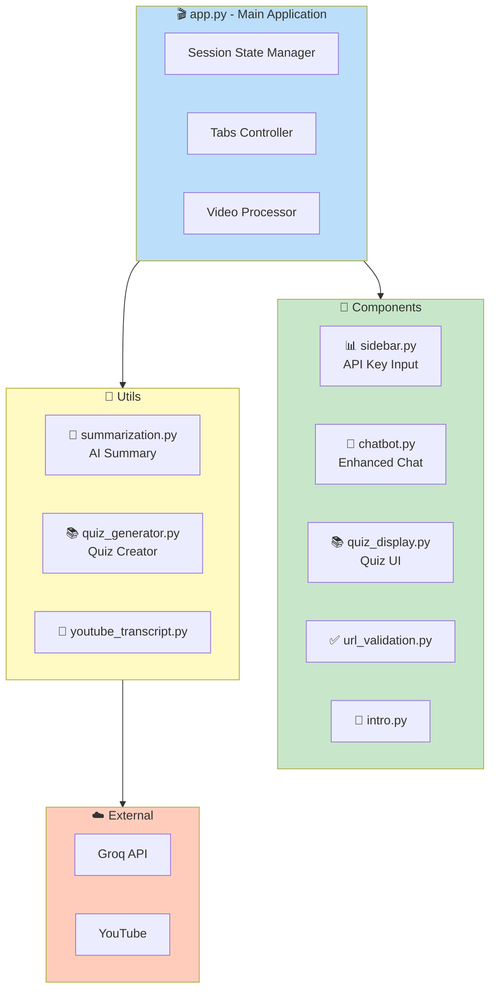
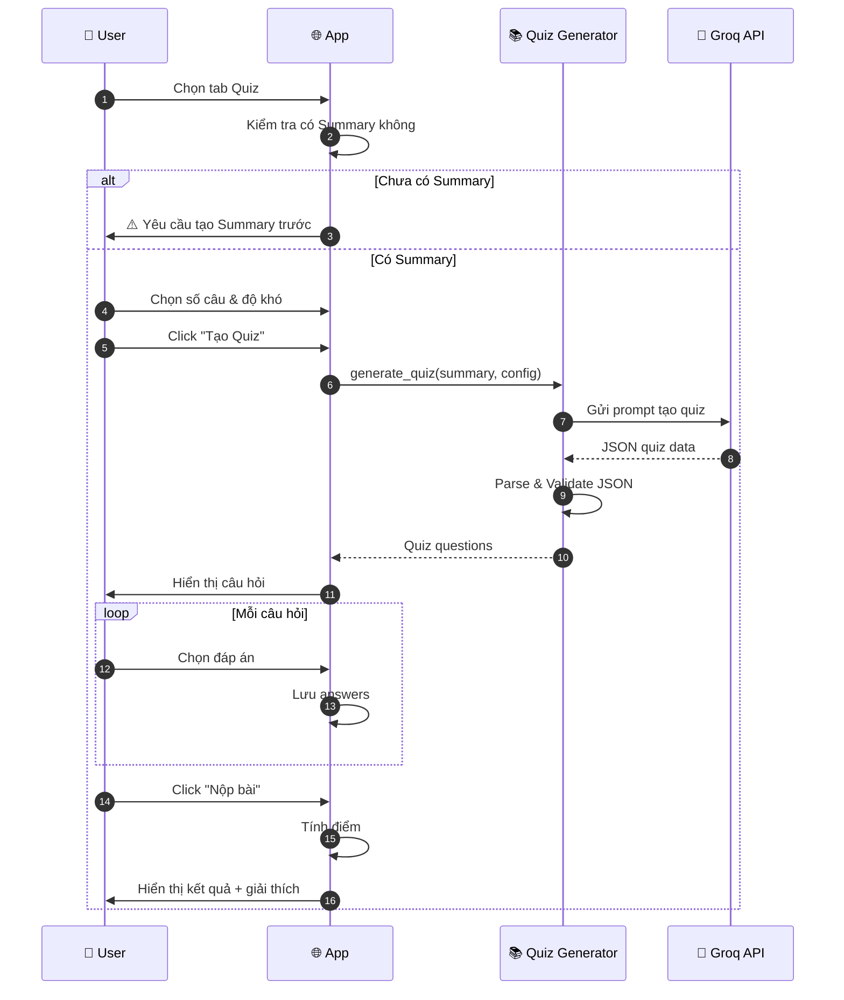
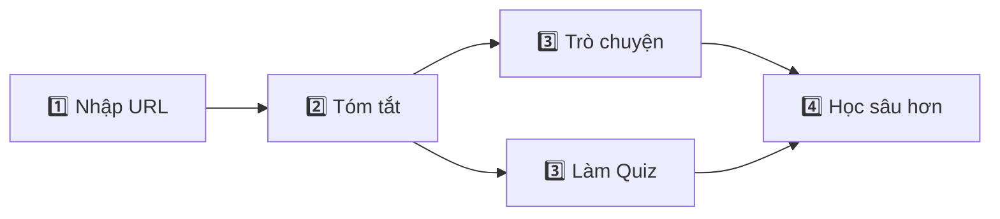
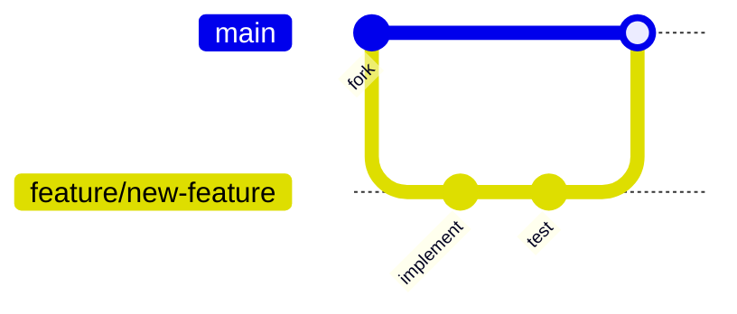

<div align="center">

# 🎬 AI YouTube Summarizer

### Công cụ tóm tắt video YouTube thông minh, Trò chuyện AI & Quiz học tập

[](https://python.org)
[](https://streamlit.io)
[](https://groq.com)
[](https://ai.meta.com/llama/)
[](https://creativecommons.org/licenses/by-nc-sa/4.0/)


**Tóm tắt • Trò chuyện • Học tập - Tất cả trong một ứng dụng**

[🚀 Bắt đầu ngay](#-cài-đặt) • [✨ Tính năng](#-tính-năng-chính) • [📖 Hướng dẫn](#-hướng-dẫn-sử-dụng) • [🤝 Đóng góp](#-hướng-dẫn-đóng-góp)

---

</div>

## 📖 Giới thiệu

**AI YouTube Summarizer** là ứng dụng web đa năng được xây dựng trên nền tảng **Streamlit**, tích hợp sức mạnh của **LLaMA 3.3-70B** thông qua **Groq API** để mang đến trải nghiệm học tập và tiếp thu nội dung video YouTube một cách hiệu quả nhất.

### 🎯 Ba chức năng chính trong một ứng dụng

```
┌─────────────────────────────────────────────────────────────┐
│                   🎬 AI YouTube Summarizer                   │
├─────────────────────────────────────────────────────────────┤
│                                                             │
│   📝 TÓM TẮT          💬 TRÒ CHUYỆN        📚 QUIZ          │
│   ───────────         ─────────────        ──────           │
│   • Tóm tắt AI        • Chat về video      • Trắc nghiệm    │
│   • Đa ngôn ngữ       • Gợi ý câu hỏi      • Nhiều độ khó   │
│   • Tải xuống         • Lịch sử chat       • Giải thích     │
│                                                             │
└─────────────────────────────────────────────────────────────┘
```

### 💡 Tại sao chọn AI YouTube Summarizer?

| Vấn đề | Giải pháp |
|--------|-----------|
| ⏰ Video quá dài, không có thời gian xem | 📝 Tóm tắt trong vài giây |
| ❓ Muốn hỏi thêm về nội dung | 💬 Chatbot AI thông minh |
| 📚 Muốn kiểm tra kiến thức | 📚 Quiz trắc nghiệm tự động |
| 🌍 Video tiếng nước ngoài | 🌐 Hỗ trợ 11+ ngôn ngữ |

---

## ✨ Tính năng chính

### 📝 Tab Tóm Tắt (Summarization)

<table>
<tr>
<td width="60%">

**Tính năng:**
- ✅ Tóm tắt video YouTube với AI LLaMA 3.3-70B
- ✅ Hỗ trợ 11+ ngôn ngữ (Việt, Anh, Pháp, Đức,...)
- ✅ Bullet points rõ ràng, dễ đọc
- ✅ Cache thông minh (1 giờ) tiết kiệm API calls
- ✅ Tải xuống bản tóm tắt (.txt)
- ✅ Tự động cắt transcript quá dài

</td>
<td width="40%">

```
📺 Video Input
    ↓
📝 Trích xuất phụ đề
    ↓
🤖 AI Tóm tắt
    ↓
📄 Hiển thị kết quả
```

</td>
</tr>
</table>

### 💬 Tab Trò Chuyện (Chat)

<table>
<tr>
<td width="60%">

**Tính năng:**
- ✅ Chat AI thông minh về nội dung video
- ✅ Context-aware - Hiểu ngữ cảnh video
- ✅ Gợi ý 5 câu hỏi phổ biến
- ✅ Lưu lịch sử conversation
- ✅ Tải xuống lịch sử chat
- ✅ Trả lời bằng tiếng Việt

</td>
<td width="40%">

**Câu hỏi gợi ý:**
- 📝 Tóm tắt lại ngắn gọn
- 🔑 Điểm chính quan trọng
- 💡 Giải thích chi tiết
- 📚 Áp dụng thực tế
- ❓ Thông tin bổ sung

</td>
</tr>
</table>

### 📚 Tab Quiz Học Tập (Quiz)

<table>
<tr>
<td width="60%">

**Tính năng:**
- ✅ Tạo câu hỏi trắc nghiệm từ AI
- ✅ 4 mức độ: 5, 10, 15, 20 câu
- ✅ 3 độ khó: Dễ, Trung bình, Khó
- ✅ Mỗi câu 4 đáp án A, B, C, D
- ✅ Hiển thị kết quả chi tiết
- ✅ Giải thích đáp án đúng
- ✅ Đánh giá điểm số (%, Grade)
- ✅ Làm lại / Tạo quiz mới

</td>
<td width="40%">

```
Kết quả Quiz:
┌─────────────────┐
│ 📝 Tổng: 10     │
│ ✅ Đúng: 8      │
│ 📊 80%          │
│ 🏆 Xuất sắc!    │
└─────────────────┘
```

</td>
</tr>
</table>

---

## 🏗️ Kiến trúc hệ thống

### Sơ đồ tổng quan



### Sơ đồ thành phần



### Sequence Diagram - Quiz Flow



---

## 🚀 Cài đặt

### 📋 Yêu cầu hệ thống

| Yêu cầu | Chi tiết |
|---------|----------|
| 🐍 Python | 3.8 trở lên |
| 📦 pip | Phiên bản mới nhất |
| 🌐 Internet | Kết nối ổn định |
| 🔑 Groq API Key | [Đăng ký miễn phí](https://console.groq.com/keys) |

### 📥 Bước 1: Clone repository

```bash
git clone https://github.com/<your-username>/ai-youtube-summarizer.git
cd ai-youtube-summarizer
```

### 🔧 Bước 2: Tạo môi trường ảo

<details>
<summary><b>💻 Windows</b></summary>

```bash
python -m venv venv
venv\Scripts\activate
```
</details>

<details>
<summary><b>🍎 macOS / Linux</b></summary>

```bash
python3 -m venv venv
source venv/bin/activate
```
</details>

### 📦 Bước 3: Cài đặt dependencies

```bash
pip install -r requirements.txt
```

#### Danh sách thư viện

| Thư viện | Mục đích |
|----------|----------|
| `streamlit` | 🌐 Framework UI |
| `groq` | 🤖 Groq API client |
| `yt-dlp` | 📺 Trích xuất phụ đề YouTube |
| `python-dotenv` | 🔐 Quản lý environment variables |
| `beautifulsoup4` | 📝 Parse HTML |
| `requests` | 🌍 HTTP requests |
| `pyperclip` | 📋 Clipboard |

---

## ▶️ Chạy dự án

### Khởi động ứng dụng

```bash
python -m streamlit run app.py
```

### 🌐 Truy cập

```
🏠 Local:    http://localhost:8501
🌍 Network:  http://<your-ip>:8501
```

---

## ⚙️ Cấu hình Environment

### Tạo file `.env`

```env
# ====================================
# 🔐 GROQ API CONFIGURATION
# ====================================

GROQ_API_KEY=gsk_xxxxxxxxxxxxxxxxxxxxxxxxxxxxxxxx

# ====================================
# 🔧 OPTIONAL SETTINGS
# ====================================

DEBUG=false
CACHE_EXPIRY=3600
```

### 🔑 Lấy Groq API Key

1. Truy cập [console.groq.com/keys](https://console.groq.com/keys)
2. Đăng ký / Đăng nhập
3. Click **"Create API Key"**
4. Copy và dán vào `.env`

> ⚠️ **Bảo mật:** Không commit file `.env` lên Git!

---

## 📁 Cấu trúc thư mục

```
ai-youtube-summarizer/
│
├── 📄 app.py                      # 🚀 Main Application (Tabs UI)
├── 📄 requirements.txt            # 📦 Dependencies
├── 📄 packages.txt                # 📦 System packages
├── 📄 License                     # 📜 CC BY-NC-SA 4.0
├── 📄 readme.md                   # 📖 Documentation
├── 📄 .env                        # 🔐 Environment variables
├── 🖼️ AI_YouTube_Summarizer.png   # 🎨 Logo
│
├── 📂 components/                 # 🧩 UI Components
│   ├── 📄 __init__.py
│   ├── 📄 chatbot.py              # 💬 Enhanced Chatbot
│   ├── 📄 quiz_display.py         # 📚 Quiz Display UI
│   ├── 📄 intro.py                # 👋 Welcome Screen
│   ├── 📄 sidebar.py              # 📊 API Key Sidebar
│   └── 📄 url_validation.py       # ✅ URL Validator
│
├── 📂 utils/                      # 🔧 Utilities
│   ├── 📄 __init__.py
│   ├── 📄 summarization.py        # 🤖 AI Summarization
│   ├── 📄 quiz_generator.py       # 📚 Quiz Generator
│   └── 📄 youtube_transcript.py   # 📝 Transcript Extractor
│
├── 📂 config/                     # ⚙️ Configuration
│   ├── 📄 __init__.py
│   └── 📄 settings.py             # 🔐 Settings Manager
│
├── 📂 styles/                     # 🎨 CSS Styles
│   ├── 📄 __init__.py
│   └── 📄 styles.py               # 💅 Custom CSS
│
└── 📂 .streamlit/                 # 🌐 Streamlit Config
    └── 📄 config.toml
```

### 📝 Mô tả các Module chính

#### 🎯 `app.py` - Main Application
- Điều phối 3 tabs chính (Tóm tắt, Trò chuyện, Quiz)
- Quản lý session state
- Xử lý video input & validation

#### 💬 `components/chatbot.py` - Enhanced Chatbot
- System prompt thông minh với context video
- Gợi ý câu hỏi tự động
- Lưu conversation history
- Export chat history

#### 📚 `utils/quiz_generator.py` - Quiz Generator
- Tạo quiz từ AI với prompt engineering
- Parse JSON response
- Fallback models nếu có lỗi
- Validate quiz data
- Tính điểm & thống kê

#### 📚 `components/quiz_display.py` - Quiz UI
- Hiển thị câu hỏi với radio buttons
- Progress bar
- Kết quả chi tiết với giải thích
- Làm lại / Tạo quiz mới

---

## 📋 Hướng dẫn sử dụng

### 🎬 Quy trình sử dụng



### Bước chi tiết

| Bước | Hành động | Mô tả |
|------|-----------|-------|
| 1️⃣ | Nhập URL | Paste link YouTube vào ô input |
| 2️⃣ | Chọn ngôn ngữ | Chọn ngôn ngữ phụ đề của video |
| 3️⃣ | Tạo Tóm tắt | Click "Tạo Bản Tóm Tắt" |
| 4️⃣ | Trò chuyện | Chuyển tab Chat, hỏi về video |
| 5️⃣ | Làm Quiz | Chuyển tab Quiz, chọn cấu hình |
| 6️⃣ | Xem kết quả | Nộp bài và xem giải thích |

### Sử dụng Quiz

1. **Chọn cấu hình:**
   - Số câu: 5 / 10 / 15 / 20
   - Độ khó: Dễ / Trung bình / Khó

2. **Làm bài:**
   - Đọc câu hỏi
   - Chọn 1 trong 4 đáp án
   - Theo dõi progress bar

3. **Nộp bài:**
   - Click "Nộp bài"
   - Xem điểm số
   - Đọc giải thích từng câu

---

## 🤝 Hướng dẫn đóng góp

### Quy trình



### Các bước

1. **Fork** repository
2. **Clone** về máy
3. **Tạo branch** mới
4. **Code** và test
5. **Commit** với conventional message
6. **Push** và tạo **Pull Request**

### Commit Convention

| Emoji | Type | Ví dụ |
|-------|------|-------|
| ✨ | feat | `✨ feat: Add quiz export PDF` |
| 🐛 | fix | `🐛 fix: Fix quiz score calculation` |
| 📝 | docs | `📝 docs: Update README` |
| 💄 | style | `💄 style: Improve quiz UI` |
| ♻️ | refactor | `♻️ refactor: Optimize prompt` |

---

## 📜 Giấy phép

**Creative Commons Attribution-NonCommercial-ShareAlike 4.0 International (CC BY-NC-SA 4.0)**

| ✅ Được phép | ⚠️ Điều kiện |
|-------------|-------------|
| Chia sẻ | Ghi công tác giả |
| Chỉnh sửa | Phi thương mại |
| | Chia sẻ tương tự |

📎 [creativecommons.org/licenses/by-nc-sa/4.0/](https://creativecommons.org/licenses/by-nc-sa/4.0/)

---

## 🗺️ Lộ trình phát triển

### ✅ Phiên bản 1.0.0 (Hiện tại)

- [x] Tóm tắt video YouTube
- [x] Hỗ trợ 11+ ngôn ngữ
- [x] Enhanced Chatbot với context
- [x] Quiz Generator với 3 độ khó
- [x] Quiz Display với kết quả chi tiết
- [x] Cache management
- [x] Download summary & chat history

### 🔜 Phiên bản 1.1.0

- [ ] Export Quiz sang PDF
- [ ] Hỗ trợ YouTube Playlist
- [ ] Lịch sử các video đã xem
- [ ] Dark/Light theme toggle
- [ ] Flashcards từ nội dung video

### 🚀 Phiên bản 2.0.0

- [ ] User authentication
- [ ] Cloud storage cho quiz & summary
- [ ] Leaderboard điểm quiz
- [ ] Spaced repetition cho flashcards
- [ ] API endpoint public

### 🌟 Phiên bản 3.0.0

- [ ] Mobile app (React Native)
- [ ] Browser extension
- [ ] AI voice narration
- [ ] Mind map generation
- [ ] Video highlights extraction

---

## 🙏 Cảm ơn

<table>
<tr>
<td align="center">
<b>Streamlit</b><br/>UI Framework
</td>
<td align="center">
<b>Groq</b><br/>AI Inference
</td>
<td align="center">
<b>LLaMA</b><br/>Language Model
</td>
<td align="center">
<b>yt-dlp</b><br/>YouTube Tools
</td>
</tr>
</table>

---

<div align="center">

### ⭐ Star repo này nếu hữu ích!

**Made with ❤️ for Vietnamese Learners**

[🐛 Báo lỗi](https://github.com/your-username/ai-youtube-summarizer/issues) • 
[💡 Đề xuất](https://github.com/your-username/ai-youtube-summarizer/issues) • 
[📧 Feedback](https://forms.gle/EphDUS8x6Z1QdLLj9)

---

**© 2026 AI YouTube Summarizer. All rights reserved.**

</div>
